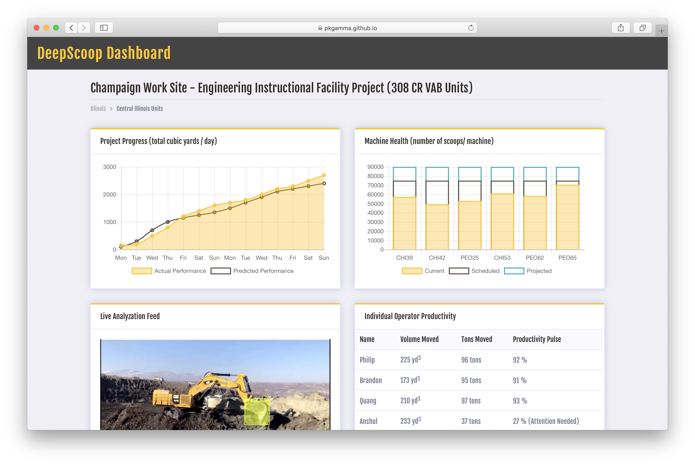

# DeepScoop ML

DeepScoop uses Machine Learning technology to transform surveillance video feeds into informative insights and empower machinery manufactures like Caterpillar with powerful analytics data.

This project was built in 36 hours at the BuiltWorld Hackathon 2019 in Chicago, IL. *We're one of the winners of the hackathon!*

## About

Caterpillar Inc., a sponsor of the BuiltWorld Hackathon 2019, proposed the problem of not being able to effectively analyze the usage and wear of their machineries across construction work sites. 

As an effort to approach this problem, we decided to take advantage of the already-available surveillance video feeds and build a machine learning model on top of the available data set. We collected a considerable amount of Caterpillar work site videos and built out the machine learning model using Mask R-CNN. 

Initially, we were using YOLOv2 to do so, but we encountered multiple memory and storage problems with the EC2 instances we had on AWS, so we decided to switch to Mask R-CNN as time turned into a big concern (training, building, and etc.). Fortunately, at the end, we are able to recognize the number of scoops of particular machines and their predicted time for maintenance and repair. 

In order to present the complex data that we collected and analyzed, we created a intuitive online dashboard for users to view the data in real time. We made sure that the online interface is intuitive, user-friendly, and mobile-friendly, so that even workers on the construction site can access it easily and see the information quickly.

## This Repository

What is presented on this git repository is solely the front end web interface of the project, which shows the final result of our hours of ML training, but is only the surface of this entire project - the tip of the iceberg. Since it is not practical to host the finished, trained result of the ML model weights and config files here on GitHub, I have included a video that shows the final result of the model and its image recognition magic at work!

### [Machine Learning Model Demo](http://www.youtube.com/watch?v=VeZQd6s9tDI)

### [DeepScoop Dashboard Demo](https://pkgamma.github.io/deepscoop-ml/)

## Tech Stack

### Machine Learning

- [Mask_RCNN](https://github.com/matterport/Mask_RCNN)
- [darkflow](https://github.com/thtrieu/darkflow)
- [OpenCV](https://opencv.org/)
- [AWS EC2](https://aws.amazon.com/ec2/)

### Dashboard Web Interface

- Bootstrap
- C3 And D3
- Peity Charts
- Data Table
- JsTree

Based on Bootstrap template provided by Colorlib.

## License

DeepScoop ML is licensed under The MIT License (MIT). Which means that you can use, copy, modify, merge, publish, distribute, sublicense, and/or sell copies of the final products.